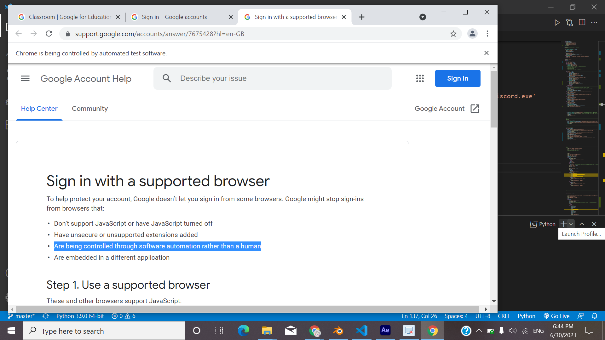

# SeKKi
SeKKi is a personalized voice -operated Desktop Assistant. He excel in various fields such as - launching applications or website, can perform searches on any website, can take a screenshot, play music from your existing library ( and many more features to be updated). Hope you like spending time with SeKKi >u&lt;

## Why would you need seKKi?
SeKKi is an intelligent virtual assistant (IVA) or intelligent personal assistant (IPA) is a software agent that can perform tasks or services for an individual based on commands or questions. Some virtual assistants are able to interpret human speech and respond via synthesized voices. Users can ask their assistants questions, control home automation devices and media playback via voice, and manage other basic tasks such as email, to-do lists, and calendars with verbal (spoken?) commands. A similar concept, however with differences, lays under the dialogue systems.The capabilities and usage of virtual assistants are expanding rapidly, with new products entering the market and a strong emphasis on both email and voice user interfaces.

## What would you learn from this Project?
Since we know  Apple and Google have large installed bases of users on smartphones. Microsoft has a large installed base of Windows-based personal computers, smartphones and smart speakers. Amazon has a large install base for smart speakers. Conversica has over 100 million engagements via its email and sms interface Intelligent Virtual Assistants for business. So, why not we create a friend for ourselfs since the merits of having a personalised voice operated assistant is unbounded.

## Features:
 * User Friendly
 * Google searches
 * Access to Wikipedia 
 * You tube search
 * seKKi can launch random websites
 * Application Launching from existing device
 * Play songs
 * play games with you
 * Built -in voice operated calculator
 * seKKi can take screenshots on command
 * Inform about time and date
 * voice operated To-Do list
 * sekki has an automated system which can sumbit your assignment on demand
 * and many more features to be added...
 
## Technologies used:
* **Python**- The entire source code is written in python.
* Python modules used:

|  MODULES  |  USES  |         
|  ----  |  ---  |        
|  pyttsx3   |  Text-to-speech conversion  |
|  speech_recognition  |  Speech -to-text conversion |
|  datetime  |  Supplies classes for manipulating dates and times  |
|  wikipedia  |   It makes easy to access and parse data from Wikipedia   
|  webbrowser  |  Provides a high-level interface to allow displaying Web-based documents to users  |
|  random  | Used to generate random data  |
|  pyautogui  |  Programitically controls mouse and keyboard  |
|  numpy  |   Used for working with arrays  |

* **Selenium** - for web automation
* webdiver module in selenium for webdriver implimentation

# Let's Get started!

## Installation:

Use pip to install the all the packages and modules mentioned in [Technologies used](https://github.com/Jasmineck/SeKKi/blob/main/README.md#technologies-used). Python 3 has pip available in the standard library. Using pip, you can install packages like this:

|  pip install pyttsx3         |
|------------------------------|

*NOTE: If pip install module is throwing  an error then try this-*

|  pip install pipwin       |
| -------------------------  |

then

|  pipwin install pyttsx3  |
|------------------------------|

For Selenium webdriver intsallation and documentation refer to [Selenium with Python](https://selenium-python.readthedocs.io/installation.html#introduction)

## How to use seKKi :

Clone the project after you are done with installation and run in terminal.
SeKKi uses basic speech commands which are user firiendly but make sure the commands have these keywords.

| COMMANDS | FUNCTIONS |
| --- | --- |
| wikipedia | To search on wikipedia |
| launch | to launch any website |
| search | to search on google or you tube | 
| songs* | to play a random song from library |
| code* | to launch vs code |
| minecraft* | to launch minecraft |
| blender* | to launch blender 3D |
| discord* | to launch discord |
| screenshot | to take a screenshot |
| time | to get update on day , date and time |
| assignment$ | to sumbit assignment in google classroom |
| to do list$ | to launch to do list |
| games | to play games with sekki |
| calculate | to perform simple mathematical operations |
| stop | to exit |

**NOTE**

"*" = since sekki is a personalised assistant the soure code contains location of those application from the owner's device so it may not be accessable to contributers.

'$' = the owner is still working on these sections due to some unknown error

## Credits :

To-do-list in collaboration with [suraj](https://github.com/RedocamaI)
original project:[To-do-list](https://github.com/RedocamaI/To-do-List)

## Issues with Sekki :

1. Commands may sometimes be difficult for sekki to understand.
2. Sekki is personalised for the owner so the collaborators have to edit the source code to fully utilize seKKi.
3. Assignment and To-do list functions does not work as expected.

The owner is facing trouble during logins in web automation.

